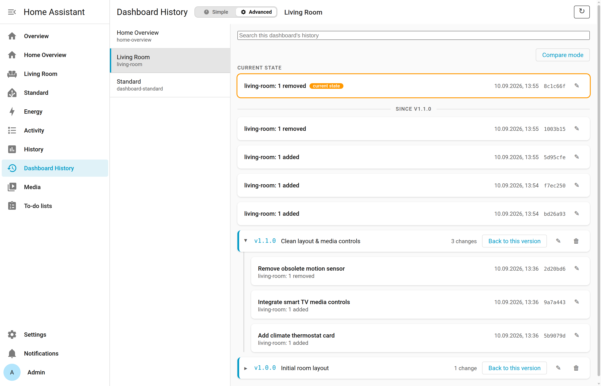
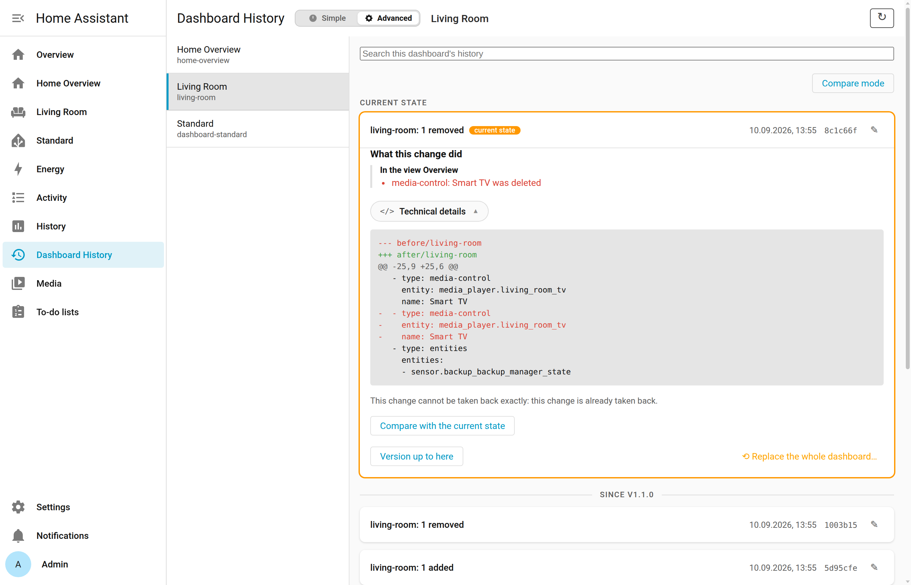

# Dashboard History

[](https://github.com/hacs/integration)
[](LICENSE)
[](https://www.home-assistant.io/)

Automated change history, milestone versioning, and instant restore for Home Assistant dashboards.

---

## 1. What It Does

Home Assistant only offers undo *while* you are editing. Close the editor or navigate away, and that history is gone. If a card was accidentally deleted or misconfigured last week, it can only be recovered from a full Home Assistant backup — if one exists at all.

**Dashboard History** gives every dashboard its own automatic, revision-controlled timeline:
- **Zero-configuration recording:** Every dashboard save is committed automatically in the background using an embedded, local Git engine ([Dulwich](https://www.dulwich.io/)).
- **Surgical restores:** Undo an individual card edit or put back a deleted card from last month without rolling back changes you made to other cards in the meantime.
- **Milestone versioning:** Bookmark important configurations with named versions before making major layout changes.
- **Full safety net:** Before any restore, the current state is confirmed to be in the recorded history — caught up automatically if the recorder missed it — and a restore that cannot confirm this is refused by default, so a rollback can always itself be undone.

<picture>
  <source media="(prefers-color-scheme: dark)" srcset="docs/images/05-history-overview-dark.png">
  <source media="(prefers-color-scheme: light)" srcset="docs/images/01-history-overview-light.png">
  
</picture>

---

## 2. Installation & Setup

### Requirements
- **Home Assistant 2024.11** or newer
- Dashboards in **storage mode** (the default UI-managed mode)
- Administrator privileges in Home Assistant

### Option A: HACS (Recommended)
1. Open **HACS** in your Home Assistant sidebar.
2. Click the three dots in the top right corner and choose **Custom repositories**.
3. Add repository: `https://github.com/PPP01/ha-dashboard-history` with type **Integration**.
4. Search for **Dashboard History**, click **Download**, and restart Home Assistant.

### Option B: Manual Installation
1. Download the latest release from the [Releases](https://github.com/PPP01/ha-dashboard-history/releases) page.
2. Copy `custom_components/dashboard_history` into your Home Assistant `<config>/custom_components/` directory.
3. Restart Home Assistant.

### Enabling the Integration
1. Go to **Settings → Devices & Services → Add Integration**.
2. Search for **Dashboard History** and submit.
3. The **Dashboard History** panel appears directly in your Home Assistant sidebar.

---

## 3. Usage

The panel is designed for fast, daily troubleshooting as well as deep forensic inspection:

<picture>
  <source media="(prefers-color-scheme: dark)" srcset="docs/images/06-diff-expanded-dark.png">
  <source media="(prefers-color-scheme: light)" srcset="docs/images/02-diff-expanded-light.png">
  
</picture>

- **Simple vs. Advanced view:** Simple view shows only the named versions — pick this for *"put it back to how it was on Tuesday."* Advanced view lists every recorded change chronologically, with its commit hash, full-text search, and the raw diff.
- **Inspect changes:** Click any history entry to expand a plain-language explanation of what it did, with the diff one click further in.
- **Action bar**, on every expanded change:
  - **Undo this change:** Takes back that one save while keeping everything saved since — offered only where the exact card it produced can still be found on the dashboard, unchanged.
  - **Version up to here:** Tags this state as a named version (patch, minor, or major).
  - **Replace the whole dashboard…:** Rolls the dashboard back to the state right before or right after this change, with a safety snapshot of the current state taken first.
- **Compare mode:** Pick any two points in the history and see what changed between them, grouped by view. Anything missing from today's dashboard gets a **Put back** button that adds it without touching anything else.

👉 **Read the full [User Guide](docs/user-guide.md)** for detailed walkthroughs, searching, versioning, and deleted dashboard recovery.

---

## 4. Capabilities & Limitations

### What It Tracks & Solves
- **All Lovelace cards:** Standard cards, custom community cards, stack containers (`vertical-stack`, `horizontal-stack`), and grid layouts.
- **View & section moves:** Detects cards moved between views or sections without recording a false deletion.
- **Smart content matching:** Lovelace cards carry no persistent identifier at all — Dashboard History uses a 4-pass, content-based matching algorithm to recognise edits and moves accurately.
- **Deleted dashboards:** If a dashboard is deleted in Home Assistant, its full history is preserved. You can inspect it and bring the dashboard back from the panel.

### Boundaries & Intentional Refusals
- **Not a full system backup.** It tracks dashboards only — automations, scripts, and entities are outside its scope.
- **No author tracking.** Home Assistant does not expose *who* made a dashboard save to integrations.
- **Lovelace badges:** A badge lives outside a view's card list, so a change to it shows up in the diff but cannot be described — or undone — in card terms. A whole-dashboard restore always recovers it.
- **Pure YAML dashboards** (`configuration.yaml` mode) generate no save events and are already under the user's own Git control, so they are outside this integration's scope.
- **The default "Overview" dashboard, before you've edited it.** Home Assistant assembles it on the fly and stores no configuration for it until you save a change yourself — only then does Dashboard History start tracking it, same as any dashboard you create.
- **Live in-memory cache:** Edits made directly to `.storage/lovelace.*` while Home Assistant is running are not picked up until the next restart — Home Assistant itself doesn't see them either.
- **No guessing:** Where the exact card a change produced can no longer be found unambiguously (edited again since, or duplicated), Undo refuses and explains why, rather than risking a wrong restore.

👉 **Read [How It Works](docs/how-it-works.md)** for the card-matching algorithm and mathematical proofs.  
👉 **Read [Limitations & Edge Cases](docs/limitations.md)** for the complete empirical boundary matrix.

---

## Documentation Hub

| Document | Contents |
| :--- | :--- |
| 📖 **[User Guide](docs/user-guide.md)** | Step-by-step panel usage, Simple/Advanced mode, Compare mode, search, and deleted dashboards |
| ⚙️ **[How It Works](docs/how-it-works.md)** | Architecture, 4-pass card matching without IDs, container model, mathematical undo safety |
| ⚠️ **[Limitations](docs/limitations.md)** | Complete 14-situation empirical matrix, edge cases, and design refusals — with a full case-by-case appendix for anyone who wants to go deeper |
| ⚡ **[HA Actions (Services)](docs/services.md)** | Automation reference for all 16 `dashboard_history.*` actions with YAML examples |
| 🛠️ **[Development & Testing](docs/development.md)** | Test runner, throwaway Docker instance, real-storage fixtures, and architecture invariants |
| ❓ **[FAQ](FAQ.md)** | Answers with the reasoning behind them — e.g. why a version number can't be changed afterwards |

---

## Testing & Development

Six core modules carry no `import homeassistant` and run under plain `pytest`:

```bash
python3 -m pytest tests/ -v
```

For integration testing against a disposable Home Assistant container, real-`.storage` fixtures, and the architecture invariants, see the **[Development & Testing Guide](docs/development.md)**.

### A note on language

Everything here is English — the code, the comments, the commit messages,
and anything on GitHub. One deliberate exception: the design record under
`docs/superpowers/` is the author's own working journal, written in
German. Nothing in it is needed to use this integration or to find your
way around the code; if you want the reasoning behind a particular
decision and don't read German, open an issue and ask — answering in
English is easy.

---

## License

This project is licensed under the MIT License - see the [LICENSE](LICENSE) file for details.

