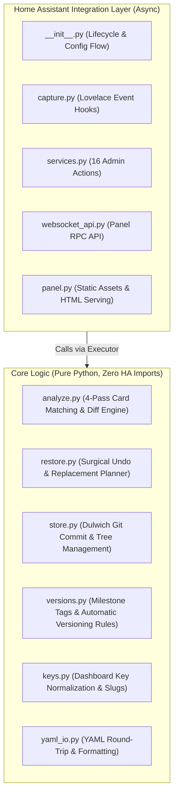

# Development & Testing Guide

This guide covers architecture conventions, running the test suite, working with the disposable Docker testbed, and guidelines for contributing to **Dashboard History**.

---

## 1. Architecture & Module Separation

The codebase strictly separates core business logic from Home Assistant runtime hooks:



### Pure Python Modules (No HA Imports)
The following six modules contain zero `import homeassistant` statements:
- `analyze.py`: Computes card diffs, moves, additions, and deletions using similarity heuristics.
- `restore.py`: Generates surgical undo patches, conflict detection, and replacement previews.
- `store.py`: Dulwich-based repository storage, commit creation, and tree management.
- `versions.py`: Named milestone tags and the rules behind the automatic ones (initial baseline, daily marks).
- `keys.py`: Canonical dashboard key normalization (`lovelace.xxx` vs `_default` vs slug).
- `yaml_io.py`: Deterministic YAML parsing and serialisation.

Because they are free of Home Assistant dependencies, they can be tested instantly in standard Python environments.

---

## 2. Hard Invariants & Design Rules

These rules are non-negotiable across the entire codebase:

1. **No shelling out to `git`:** All Git interactions must use [Dulwich](https://www.dulwich.io/). HA OS, Container, and Core environments cannot guarantee that a `git` binary exists.
2. **No monkey-patching:** Never intercept or patch Home Assistant internal classes, methods, or WebSocket endpoints.
3. **Never block HA startup:** Any exception encountered during startup or save recording is caught and logged. A degraded dashboard history is tolerable; a hanging Home Assistant instance is not.
4. **Executor for disk & git operations:** Dulwich calls perform synchronous disk I/O. All repository writes and reads must run inside `hass.async_add_executor_job`.
5. **Admin privileges required:** Every WebSocket command (`@websocket_api.require_admin`) and service action (`async_register_admin_service`) requires administrator privileges.
6. **No state mutation without preview:** Any irreversible action (restoring state, rewriting history, dropping tags) requires an explicit `confirm: true` payload. Without it, the backend returns only a preview diff.

---

## 3. Running Unit Tests

Unit tests are executed via `pytest`:

```bash
# Run the entire test suite
python3 -m pytest tests/ -v
```

### Real Storage Integration Tests
Some tests verify behavior against real-world, complex dashboard datasets (1,000+ cards and deeply nested stacks):
- Set the environment variable `DASHBOARD_HISTORY_REAL_STORAGE=/path/to/.storage`, or
- Create an untracked file `tests/.real-storage` containing the path to a test `.storage` directory.

If neither is configured, these real-storage tests **skip visibly** (`...s...`) rather than silently passing.

---

## 4. Integration Testing with Disposable Docker

While unit tests cover the pure Python core, integration with Home Assistant's event bus, WebSocket protocol, and panel loading requires a live runtime. A throwaway Docker Compose setup is provided under `docker/`:

```bash
# Start the disposable Home Assistant container
docker compose -f docker/compose.yaml up -d

# Run end-to-end WebSocket and service verification
python3 tests/integration/run_checks.py

# Run browser automation tests against the frontend panel
python3 tests/integration/look_at_panel.py
```

### Where Data Lives During Docker Tests
- **Container compose file:** `docker/compose.yaml` (version-controlled).
- **Test instance configuration & bearer tokens:** Kept in `../ha-dashboard-history-test/` **outside** this repository to prevent credential leaks.
- **Integration code:** The working tree `custom_components/dashboard_history` is bind-mounted directly into the container. Code changes take effect immediately upon container restart (`docker restart dashboard-history-test`).

### Container-Internal Tests
To test operations that require Home Assistant imports without spinning up the full event loop (e.g. historical date and calendar boundary calculations):

```bash
docker exec -i dashboard-history-test python3 - < tests/integration/run_day_marks.py
```

---

## 5. Capturing Demo & Documentation Screenshots

High-resolution retina screenshots for the documentation are generated automatically using Playwright:

```bash
# Start the demo container on port 8125
docker compose -f docker/compose.demo.yaml up -d

# Capture both Light and Dark mode screenshots
python3 tools/capture_demo_screenshots.py
```

The script populates `docs/images/` with optimized 2x retina captures.

---

## 6. Language Conventions

- **English for all public artifacts:** Code, comments, docstrings, commit messages, documentation, GitHub issues, and PRs are strictly in English.
- **German design journal:** The design records under `docs/superpowers/` are the author's internal development journal documenting historical architectural decisions and empirical measurements.
