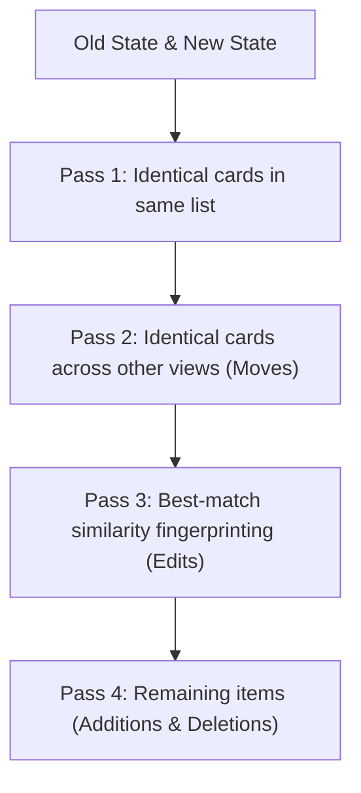
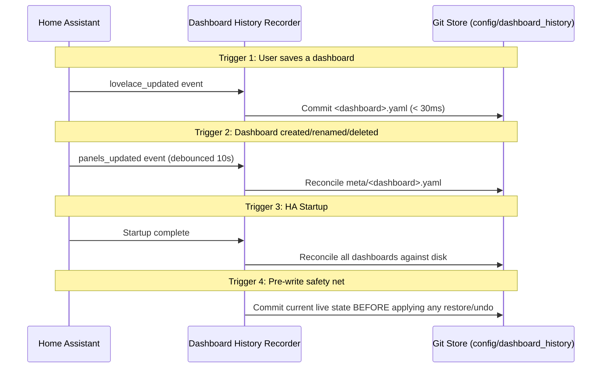

# How It Works: Architecture & Mechanics

This document explains the technical architecture, algorithms, and design choices behind **Dashboard History**.

---

## 1. Recognising Cards Without Identifiers

In Home Assistant, a Lovelace card carries **no identifier**. Not a hidden one, not an optional one. Counted across the eleven dashboards on the installation this was built against: **1,523 cards, including those nested in stacks, and exactly 0 with an `id`.** A card is defined purely by its position in a list.

When two states of a dashboard are compared, cards must be matched **by content**. Dashboard History uses a four-pass algorithm:



1. **Pass 1 — Exact match in place:** Identical cards pair up within the same card list. Same content, same position: the card did not change.
2. **Pass 2 — Global search for moves:** Unpaired cards are looked for across all other views and sections. A card found elsewhere was *moved* (and is therefore not missing).
3. **Pass 3 — Best-match similarity pairing:** Remaining cards within the same container are paired using a content-based fingerprint (`entity`, `title`, `name`, `heading`, first entity of a list, or first line of text) and scored for similarity. The candidate with the highest similarity score wins. That card was *edited*.
4. **Pass 4 — Additions and Deletions:** Anything still unpaired is classified as a genuine deletion on one side and a genuine addition on the other.

### Why order and best-match matter

- **Pass 1 before Pass 2:** If a global search ran first, deleting a card from View A while an identical card sat in View B would pair the deleted card with the untouched one, hiding the deletion entirely. Every card claims its own position first.
- **Pass 3 uses best-match, not first-match:** Suppose two tile cards control the same light. You delete the first and change the second from blue to green. The surviving card matches its own previous version in 3 of 4 fields, but the deleted card in only 2 of 5. By selecting the closest pair, the card offered for recovery is the one that was actually deleted.

---

## 2. Views, Sections, and Containers

The comparison engine traverses two kinds of containers:

| Container | Identified by | Stable across edits? |
| :--- | :--- | :--- |
| **View** | URL path | **Yes** (when a path is defined) |
| **Section** | Positional index, verified against title | **No** (titles are optional; sections lack IDs) |

### Views without URL paths

Home Assistant allows views without URL paths (keyed by index). When positions shift, keys change. The integration guards against these shifts and refuses operations that cannot be verified.

### Badges

Badges sit outside card lists and views. Because they are not cards, changes to badges are recorded in the commit diff, but cannot be described in card terms by `explain_change`. They are recovered through whole-state restoration.

---

## 3. The Proof Behind "Undo This Change"

*Undo this change* does not perform a heuristic merge or guess what you meant. It operates from a strict mathematical proof:

> **The Proof:** Take the card produced by the change, byte for byte, and look for it in the dashboard as it stands today.
> - **Found exactly once:** It can be pointed to unambiguously without an ID. Removing it and restoring the previous card is a provably exact exchange.
> - **Found twice, or not at all:** There is either nothing to point to, or no way to distinguish between duplicate candidates. The undo **refuses** and explains why.

This proof is evaluated both when rendering the preview and again on the confirmation call (to guard against concurrent edits made while viewing the preview).

Because of this proof, Undo covers **edits and moves**, not just deletions. Modifying an `entities` card, changing markdown text, or moving a card between views can all be taken back surgically without touching any changes saved afterwards.

**The proof does not run out with time.** Thirty saves and a week later, Undo still takes back one specific save and leaves the other twenty-nine standing — what it needs is not haste but the card that change produced, unchanged on the dashboard. What ends it is a second edit to the same card, not the calendar.

---

## 4. When Changes Are Recorded

Four triggers ensure no change is missed:



1. **`lovelace_updated`:** Fired immediately whenever a dashboard is saved. Committed within milliseconds.
2. **`panels_updated`:** Fired when dashboards are created, renamed, or deleted. Debounced for 10 seconds to collapse rapid bursts.
3. **Startup pass:** Reads all dashboards on Home Assistant startup and commits any changes made while offline.
4. **Pre-write safety snapshot:** Before applying an undo or state restore, the integration records the current state first. You can never lose your current state by going backward.

---

## 5. Direct `.storage` Manipulation

If you edit `.storage/lovelace.<key>` directly on disk:
- **Home Assistant will not see it until restart.** HA loads dashboard JSON once on boot into memory (`LovelaceStorage`) and serves requests from memory.
- **The next UI save overwrites your edit.** HA writes back its in-memory state, discarding external file edits.
- Therefore, Dashboard History records what Home Assistant's API sees. External file edits are picked up only upon HA restart.

---

## 6. Where the Data Lives: Git & Dulwich

All history is stored in:
```
/config/dashboard_history/
```
This is a standard Git repository owned and managed by Dashboard History:
- **One commit per save:** Stores `<dashboard>.yaml` and `meta/<dashboard>.yaml`.
- **Versions as tags:** Annotated Git tags (e.g. `living-room/v1.0.0`).
- **Notes as Git notes:** User notes attached without rewriting commit hashes.

### No System Git Dependency

The integration uses **Dulwich**, a pure-Python Git implementation:
- Works identically across Home Assistant OS, Container, Supervised, and Core.
- No `git` CLI executable is required on the host system.
- All blocking I/O runs inside an executor (`hass.async_add_executor_job`) to keep the HA event loop completely free.
- YAML parsing is accelerated via `libyaml` (measured 8–9x faster than pure-Python PyYAML).

### Storage Footprint

Because Git stores content using zlib compression and content-addressable deduplication, a save that changes one card adds only a few kilobytes. Measured on the installation this was built against: the largest dashboard is 262 KB as YAML, and the first recorded state of every dashboard came to roughly 620 KB in total.

