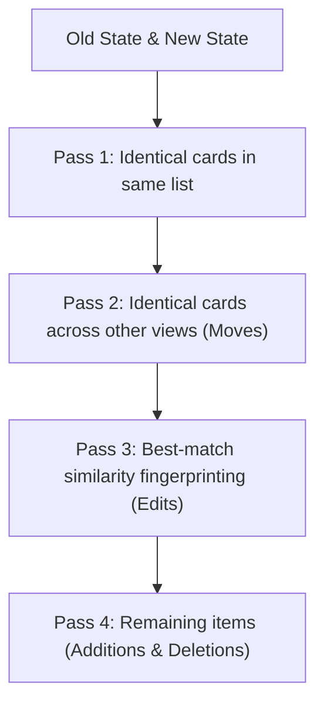
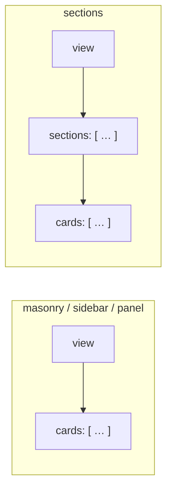
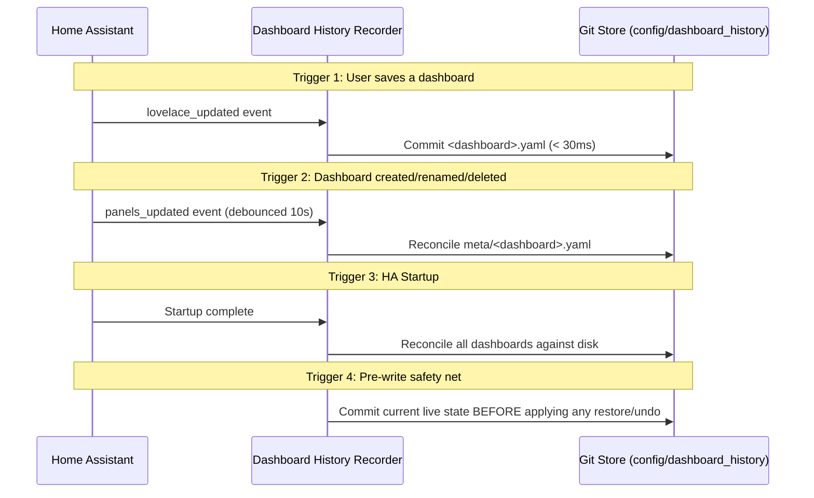

# How It Works: Architecture & Mechanics

This document explains the technical architecture, algorithms, and design choices behind **Dashboard History**.

---

## 1. Recognising Cards Without Identifiers

In Home Assistant, a Lovelace card carries **no identifier**. Not a hidden one, not an optional one. Counted across the eleven dashboards on the installation this was built against: **1,523 cards, including those nested in stacks, and exactly 0 with an `id`.** A card is defined purely by its position in a list.

When two states of a dashboard are compared, cards must be matched **by content**. Dashboard History uses a four-pass algorithm:


```mermaid
flowchart TD
    A["Old State & New State"] --> B["Pass 1: Identical cards in same list"]
    B --> C["Pass 2: Identical cards across other views (Moves)"]
    C --> D["Pass 3: Best-match similarity fingerprinting (Edits)"]
    D --> E["Pass 4: Remaining items (Additions & Deletions)"]
```

1. **Pass 1 — Exact match in place:** Identical cards pair up within the same card list. Same content, same position: the card did not change.
2. **Pass 2 — Global search for moves:** Unpaired cards are looked for across all other views and sections. A card found elsewhere was *moved* (and is therefore not missing).
3. **Pass 3 — Best-match similarity pairing:** Remaining cards within the same container are paired using a content-based fingerprint (`entity`, `title`, `name`, `heading`, first entity of a list, or first line of text) and scored for similarity. The candidate with the highest similarity score wins. That card was *edited*.
4. **Pass 4 — Additions and Deletions:** Anything still unpaired is classified as a genuine deletion on one side and a genuine addition on the other.

### Why order and best-match matter

- **Pass 1 before Pass 2:** If a global search ran first, deleting a card from View A while an identical card sat in View B would pair the deleted card with the untouched one, hiding the deletion entirely. Every card claims its own position first.
- **Pass 3 uses best-match, not first-match:** Suppose two tile cards control the same light. You delete the first and change the second from blue to green. The surviving card matches its own previous version in 3 of 4 fields, but the deleted card in only 2 of 5. By selecting the closest pair, the card offered for recovery is the one that was actually deleted.

---

## 2. Views, Sections, and Containers

Home Assistant nests a view's content in one of two shapes, and the shape decides how many identity-less layers sit between a view and its cards.

**`masonry` views** — the classic layout, and `sidebar`/`panel` behave the same way for this purpose — hold their cards directly, in a flat `cards:` list. One container between the view and a card: the view itself.

**`sections` views** — Home Assistant's default layout for dashboards created since 2024.6 — hold a list of `sections:`, and each section holds its own `cards:` list. Two containers between the view and a card: the view, then the section.


```mermaid
flowchart LR
    subgraph M["masonry / sidebar / panel"]
        V1["view"] --> C1["cards: [ … ]"]
    end
    subgraph S["sections"]
        V2["view"] --> SEC["sections: [ … ]"]
        SEC --> C2["cards: [ … ]"]
    end
```

A card has no identifier either way (§1) — that half of the problem is identical in both shapes. What differs is everything *above* the card:

| Container | Identified by | Stable across edits? |
| :--- | :--- | :--- |
| **View** | URL path | **Yes** (when a path is defined) |
| **Section** | Positional index, verified against the section's own settings (everything but its `cards`, `title` included) | **Partly** — Home Assistant's editor rarely sets anything beyond `type`/`cards`; measured on the installation this was built against, **0 of 80 sections carried a title**, and two sections whose settings are otherwise identical still cannot be told apart |

A view usually has an escape hatch a section never gets: a `path`, stable across reorderings, deletions elsewhere, anything. A section has nothing equivalent — Home Assistant assigns it neither a path nor an ID, ever. It is addressed purely by where it sits in the list, which is exactly the kind of address that stops meaning the same thing the moment a neighbouring section is added, removed, or reordered.

### Why this is currently a problem

The card-matching algorithm in §1 operates on cards, full stop — it never treats a section as a comparable unit of its own. Concretely: matching flattens every card of a view into one pool, sections included, and pairs cards by content **regardless of which section they sit in**. This has two consequences, one of them narrowed on 2026-09-24, the other still open:

- **A section that moves as a whole, unchanged block is still reported as N individual card moves**, one line per card, rather than as the one event it actually is — the matcher has no concept of "this whole section relocated," only of "these cards each ended up somewhere else." This is unaffected by the fix below; closing it needs sections matched as units, not a safety check.
- **The one safety check that exists for this — comparing each section's own settings between the states being compared (`_section_drift` in `analyze.py`, since 2026-09-25 per view rather than per dashboard) — used to be blind to the common case**, because until 2026-09-24 it only read the section's own `title` field, and Home Assistant's editor never sets one (0 of 80, above). Two sections that carried no title were indistinguishable to the check even when they carried different settings (`column_span` and the like), so a change that swapped two such sections could pass the check and offer an exact-looking *Undo* that wrote cards back to the right place while leaving section-level settings behind at the old position ([issue #31](https://github.com/PPP01/ha-dashboard-history/issues/31)). The guard now compares every field of a section but its `cards`, so a swap where the settings differ is refused instead of written silently. What remains: two sections that agree on **every** setting and differ only in the cards they hold are still indistinguishable to the guard — harmlessly, since the settings left behind at each position are the same ones either way. See [Limitations & Boundaries](limitations.md#sections-in-detail) for the measured cases, including the ones this leaves unresolved.

Since 2026-09-25, the integration takes the same way out Home Assistant's own editor already uses for the related problem of *where a card belongs* (Decision 26 in the design journal): when a card's section inside a sections view cannot be proven any more — because the sections were rearranged after the change — it is parked in the view's own `cards:` list, the "Imported cards" area Home Assistant shows in edit mode. The undo's button then reads *Undo this change\**. A change that rearranged the sections itself is still refused ([GitHub issue #30](https://github.com/PPP01/ha-dashboard-history/issues/30)).

### Views without URL paths

Home Assistant allows views without URL paths, keyed by index instead. This is the same shape of problem as a section's missing identity, one level up — with two differences: it is optional (most views have a path; no section ever does) rather than universal, and the identity chain proposed to close it (Decision 16 in the design journal) was decided in 2026 but, as of this writing, was never built — the guard described above is what actually runs.

When positions shift — even because an unrelated, earlier view was deleted or a new one inserted before it — the same index keys a different view than before. The integration guards against these shifts and refuses operations it cannot verify, rather than writing to a view that never asked for it. See [Limitations & Boundaries](limitations.md#4-views-without-a-url-path) for the measured cases.

Until 2026-09-24 the undo's guard was stricter than it needed to be here: it compared the *whole* set of positions between two states, so a view appended at the end — which cannot have shifted anything before it — blocked every older undo just as thoroughly as a real deletion or insertion would have. Positions are now only compared up to the length of the shorter of the two states, so an appended view falls outside the comparison instead of tainting it ([issue #33](https://github.com/PPP01/ha-dashboard-history/issues/33)). For the same reason, a dashboard with exactly one view in both states is never refused on position grounds: with no neighbour, nothing can have moved in front of it, and it needs neither a path nor a title to be recognised. An insertion or deletion *within* that shared length still refuses, deliberately — by length alone it looks exactly like an append, and only checking whether the position's content still matches at that shared length tells the two apart.

### Badges

Badges sit outside card lists and views. Because they are not cards, changes to badges are recorded in the commit diff, but cannot be described in card terms by `explain_change`. They are recovered through whole-state restoration. Until badges get the same treatment ([issue #29](https://github.com/PPP01/ha-dashboard-history/issues/29)), that is how it stays for them. Named settings are different, and handled since 2026-09-25 ([issue #28](https://github.com/PPP01/ha-dashboard-history/issues/28)): a view's `title`/`icon`/`theme`/`visible`, or a key in a dashboard's `strategy:` block, is identified by its name in every state. The history explains and counts such a change, and *Undo this change* takes it back after one check — is the value the change left still there? Section settings (`column_span` and the like) are not included: a section has no name to address it by.

---

## 3. The Proof Behind "Undo This Change"

*Undo this change* does not perform a heuristic merge or guess what you meant. It operates from a strict mathematical proof:

> **The Proof:** Take the card produced by the change, byte for byte, and look for it in the dashboard as it stands today.
> - **Found exactly once:** It can be pointed to unambiguously without an ID. Removing it and restoring the previous card is a provably exact exchange.
> - **Found twice, or not at all:** There is either nothing to point to, or no way to distinguish between duplicate candidates. The undo **refuses** and explains why.

This proof is evaluated both when rendering the preview and again on the confirmation call (to guard against concurrent edits made while viewing the preview).

Because of this proof, Undo covers **edits and moves**, not just deletions. Modifying an `entities` card, changing markdown text, or moving a card between views can all be taken back surgically without touching any changes saved afterwards.

**The proof does not run out with time.** Thirty saves and a week later, Undo still takes back one specific save and leaves the other twenty-nine standing — what it needs is not haste but the card that change produced, unchanged on the dashboard. What ends it is a second edit to the same card, not the calendar.

---

## 4. When Changes Are Recorded

Four triggers ensure no change is missed:


```mermaid
sequenceDiagram
    participant HA as Home Assistant
    participant REC as Dashboard History Recorder
    participant GIT as Git Store (config/dashboard_history)

    Note over HA,GIT: Trigger 1: User saves a dashboard
    HA->>REC: lovelace_updated event
    REC->>GIT: Commit <dashboard>.yaml (< 30ms)

    Note over HA,GIT: Trigger 2: Dashboard created/renamed/deleted
    HA->>REC: panels_updated event (debounced 10s)
    REC->>GIT: Reconcile meta/<dashboard>.yaml

    Note over HA,GIT: Trigger 3: HA Startup
    HA->>REC: Startup complete
    REC->>GIT: Reconcile all dashboards against disk

    Note over HA,GIT: Trigger 4: Pre-write safety net
    REC->>GIT: Commit current live state BEFORE applying any restore/undo
```

1. **`lovelace_updated`:** Fired immediately whenever a dashboard is saved. Committed within milliseconds.
2. **`panels_updated`:** Fired when dashboards are created, renamed, or deleted. Debounced for 10 seconds to collapse rapid bursts.
3. **Startup pass:** Reads all dashboards on Home Assistant startup and commits any changes made while offline.
4. **Pre-write safety snapshot:** Before applying an undo or state restore, the integration records the current state first. You can never lose your current state by going backward.

---

## 5. Direct `.storage` Manipulation

If you edit `.storage/lovelace.<key>` directly on disk:
- **Home Assistant will not see it until restart.** HA loads dashboard JSON once on boot into memory (`LovelaceStorage`) and serves requests from memory.
- **The next UI save overwrites your edit.** HA writes back its in-memory state, discarding external file edits.
- Therefore, Dashboard History records what Home Assistant's API sees. External file edits are picked up only upon HA restart.

---

## 6. Where the Data Lives: Git & Dulwich

All history is stored in:
```
/config/dashboard_history/
```
This is a standard Git repository owned and managed by Dashboard History:
- **One commit per save:** Stores `<dashboard>.yaml` and `meta/<dashboard>.yaml`.
- **Versions as tags:** Annotated Git tags (e.g. `living-room/v1.0.0`).
- **Notes as Git notes:** User notes attached without rewriting commit hashes.

### No System Git Dependency

The integration uses **Dulwich**, a pure-Python Git implementation:
- Works identically across Home Assistant OS, Container, Supervised, and Core.
- No `git` CLI executable is required on the host system.
- All blocking I/O runs inside an executor (`hass.async_add_executor_job`) to keep the HA event loop completely free.
- YAML parsing is accelerated via `libyaml` (measured 8–9x faster than pure-Python PyYAML).

### Storage Footprint

Because Git stores content using zlib compression and content-addressable deduplication, a save that changes one card adds only a few kilobytes. Measured on the installation this was built against: the largest dashboard is 262 KB as YAML, and the first recorded state of every dashboard came to roughly 620 KB in total.

