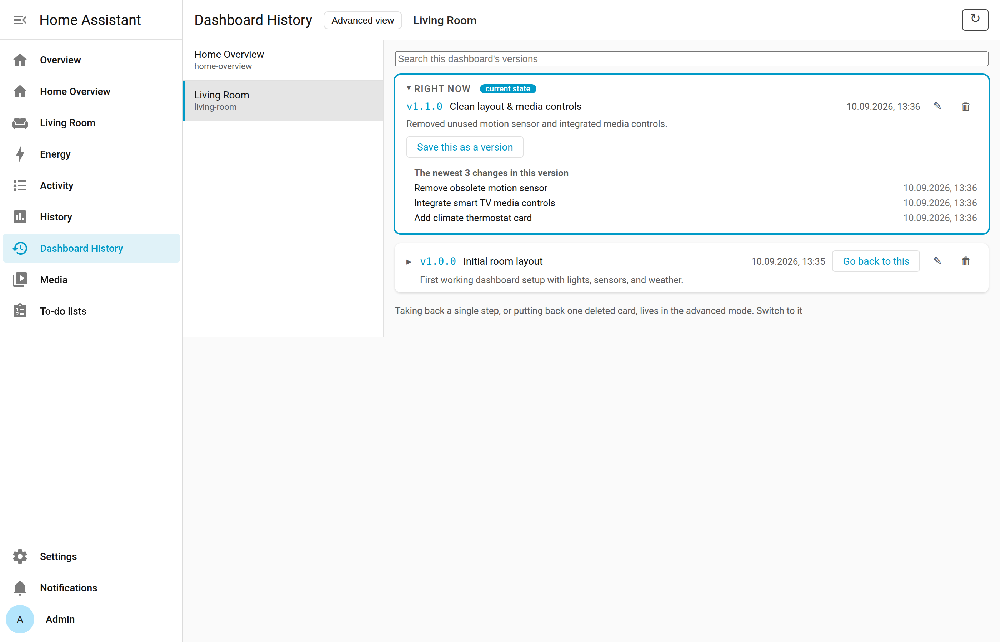
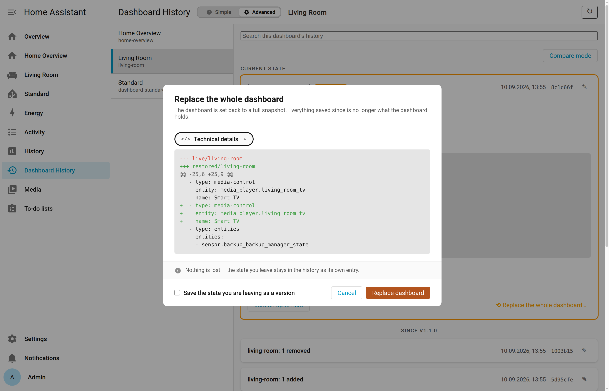
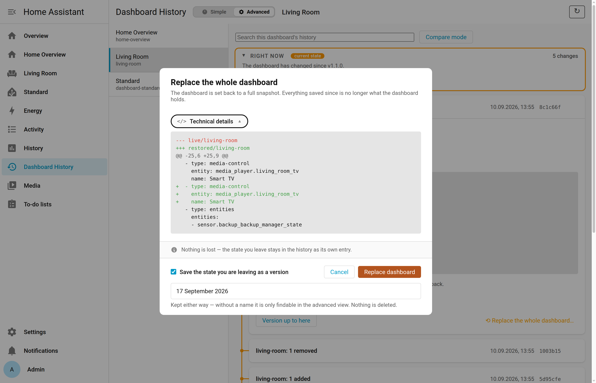
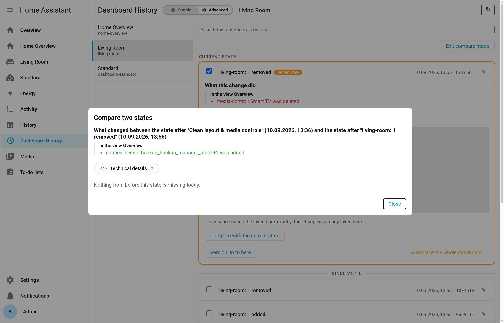

# User Guide

This guide covers everything you need to know about using **Dashboard History** from the Home Assistant panel.

---

## The Panel

Once installed, **Dashboard History** appears in the Home Assistant sidebar. Pick a dashboard from the left panel to see its history, newest first.

### Sidebar arrangement and hidden dashboards

The dashboard list reflects your personal sidebar, in your sidebar's order:
- An arrangement you dragged into place is personal to your user profile; Dashboard History honors that exact order.
- Dashboards that are hidden from the sidebar (either globally or for your user) are folded away at the bottom under **Not in the sidebar (N)**.
- If you rearrange your sidebar in another tab, click the **reload icon** in the top right to refresh the list.

### Current state indicators

At the top of the list sits the state your dashboard currently has. This mark is *worked out*, not assumed: if a dashboard was changed behind Home Assistant's back (a hand edit picked up on restart, for example), the newest recorded entry is not what you actually have, and then nothing at the top is marked at all.
- **Blue accent / ring:** The dashboard as it stands right now matches a recorded version.
- **Orange accent / ring:** The dashboard has unsaved or unversioned changes since the last version was tagged.
- If an older historical entry holds the exact same YAML content as today's state, it is explicitly marked with **same state as now** — which is what makes a history that went back and forth readable at all.

---

## Two Views

You can switch between two views using the segmented control in the top bar. Your choice is stored in your browser's local storage and remembered across sessions.

### Simple View

Simple view is designed for quick, everyday recovery (*"put it back to how it was on Tuesday"*):
- Shows only **named versions** (milestones), each forming a collapsible section.
- At the top, the **Current state** box shows where you stand:
  - If you are on a named version, it displays the version number, title, and date.
  - If changes were made since the last version, it displays **Undo / Go back to &lt;version&gt;** and **Save this as a version**.
  - Clicking a version's **Go back to this version** button opens the restore preview dialog.

<picture>
  <source media="(prefers-color-scheme: dark)" srcset="images/08-simple-mode-versions-dark.png">
  
</picture>

### Advanced View

Advanced view exposes every single recorded change:
- Lists all saves in reverse chronological order, 25 at a time, with a **Load older changes** button.
- Version headers divide the changes into logical sections.
- Every row shows the automatic change summary (e.g. *"living-room: 1 removed"*), the timestamp, and the short commit hash.
- Click any row to expand its details and access the action bar.

<picture>
  <source media="(prefers-color-scheme: dark)" srcset="images/05-history-overview-dark.png">
  
</picture>

---

## Searching History

A search box sits above the history list:
- In **Simple view**, searching filters the visible versions by title, number, or description.
- In **Advanced view**, searching filters the loaded changes. If no match is found among the loaded entries, a button appears offering **Search the whole history**. Clicking it queries the server to walk the entire recorded history across automatic summaries, your custom notes, and version metadata.

---

## Change Cards & The Action Bar

Clicking any change in the Advanced view expands it to reveal:

1. **Plain-language summary:** Describes what changed in human terms (e.g. *"In the view Living Room: tile: Ceiling Light was moved to Kitchen"*).
2. **Technical details pill:** A collapsible `<summary><span class="glyph">&lt;/&gt;</span> Technical details</summary>` element containing the exact unified YAML diff.
3. **The Action Bar:** A unified toolbar at the bottom of the expanded card with three core actions:

<picture>
  <source media="(prefers-color-scheme: dark)" srcset="images/06-diff-expanded-dark.png">
  
</picture>

```
[ Undo this change ]  [ Version up to here ]  [ Replace the whole dashboard ]
```

### 1. Undo this change

Takes back that single save while leaving all subsequent changes untouched.
- **When it is available:** Offered only when the change can be *proven* exact: the card that was produced or altered must still exist in today's dashboard, byte for byte, and appear exactly once.
- **When it refuses:** If the card was modified again later, or if identical duplicate cards exist, the button is replaced by an explanatory message:
  > *This change cannot be taken back exactly: tile: Ceiling Light was changed again after this, so there is no exact version left to put back.*
- **Preview & confirmation:** Clicking the button shows a preview diff and the plain-language effect. The dashboard is not modified until you click the confirmation button.

### 2. Version up to here

Tags the exact state of the dashboard after this change as a named version.
- Opens a dialog offering three semantic versioning buttons: **Patch**, **Minor**, and **Major**.
- The version numbers are calculated automatically from the highest version that dashboard already possesses (e.g. bumping `v1.1.0` to `v1.1.1`, `v1.2.0`, or `v2.0.0`).
- Enter an optional title and description.
- Creating a version writes an annotated git tag; it does not alter dashboard contents and requires no confirmation.

### 3. Replace the whole dashboard

Replaces the current dashboard entirely with an earlier state:
- Opens a dedicated overlay offering a choice:
  - **(•) Before this change:** Restores the dashboard to the state right before this save took place.
  - **( ) After this change:** Restores the dashboard to the state resulting from this save.
- Previews for both options are fetched in parallel so toggling between them is instantaneous.
- Includes a checkbox: **Save the state you are leaving as a version**. When checked, the state you are leaving is safely tagged with a version before the older state is written — ticked by default in Simple view, since a state with no name is, to that view, gone. The box is hidden when the state you are leaving already holds a version of its own.

<picture>
  <source media="(prefers-color-scheme: dark)" srcset="images/07-replace-dialog-dark.png">
  
</picture>

<picture>
  <source media="(prefers-color-scheme: dark)" srcset="images/07b-restore-dialog-checked-dark.png">
  
</picture>

---

## If Your Dashboard Uses Sections

Cards inside a section are handled exactly like cards in a view — deleted, edited, or dragged into another section, all recognised and recoverable with the same tools. The section itself is the weaker spot: Home Assistant's editor gives a section no identifier at all, so Dashboard History only knows one by its position in the row, cross-checked against its title.

> [!TIP]
> **Give your sections titles.** A title is the only thing Dashboard History can use to recognise a section by. Without one, reordering two untitled sections in the same save as a card edit can — in this one specific case — file the restored card into the wrong section, silently. With a title, the same situation becomes an honest refusal instead of a silent mistake. See [Limitations & Boundaries](limitations.md) for the full, measured breakdown.

Setting the whole dashboard back to an earlier state always works for sections, exactly as for everything else — nothing is ever unrecoverable; what the narrow tools lose is precision, not content.

---

## Compare Mode & Putting Items Back

Compare Mode allows you to compare any two states in the dashboard's history and selectively restore missing cards.

### How to use Compare Mode:

1. In Advanced view, activate **Compare** mode.
2. Checkboxes appear next to each row, including **Current state**.
3. Select **any two rows** to compare.
4. A comparison modal opens:
   - Differences are grouped by view.
   - For every card that existed in the older state but is missing in today's state, a **Put back** button is offered.
5. **Put back** is strictly additive: it inserts the missing item into today's dashboard at its original location without overwriting or modifying any other cards saved since then.

<picture>
  <source media="(prefers-color-scheme: dark)" srcset="images/08-compare-mode-dark.png">
  
</picture>

---

## Managing Versions

Versions are dashboard-scoped annotated git tags (e.g. `living-room/v1.2.0`). Because they belong to an individual dashboard, different dashboards can each have their own `v1.0.0`.

### Automatic versions

Two kinds of versions are created for you automatically:
- **`v1.0.0` (Initial baseline):** Created the first time Dashboard History encounters a dashboard.
- **Daily milestones:** If a dashboard contains unversioned changes from previous days, the next edit automatically generates a new version. This version captures the state immediately prior to the new changes and is tagged with the date of the last modification (e.g. `14 September 2026`). Days without changes receive no tag.

> [!TIP]
> You can toggle automatic daily versions on or off under **Settings → Devices & Services → Dashboard History → Configure**.

### Renaming a version

Hover over any version row or header to reveal the **pencil icon**:
- You can edit the **title** and **description** at any time.
- The **version number itself cannot be renamed** (it serves as the immutable ref name). See the [FAQ](../FAQ.md#why-cant-i-change-a-version-number-afterwards) for the rationale.

### Removing a version

Click the **trash bin icon** next to the pencil:
- Removing a version removes the tag and its title/description.
- **The underlying dashboard state is NOT deleted.** Every recorded state remains in the history and can be accessed in Advanced view.
- If you remove the highest version number, that number is freed for the next version you create.
- Removing one of the **automatic** versions (the initial baseline or a daily mark) doesn't necessarily make it go away for good: if a save right now would trigger the same automatic mark again, it comes back on its own. The confirmation dialog tells you when that applies.

---

## Adding Notes to Changes

Hover over any change row in Advanced view and click the **pencil icon**:
- Type your note and press Enter.
- Your note becomes the primary headline of that history entry, while the automatic summary remains visible underneath in muted text.
- Clearing the text removes the note.
- Notes are stored as Git notes and do not rewrite commit hashes.

---

## Renames, Icons, and Sidebar Visibility

A dashboard's title, icon, and sidebar setting live in Home Assistant's own registry rather than in the dashboard configuration, and Home Assistant fires no event when they change. Dashboard History picks them up the same way it notices a dashboard being created or deleted — through the sidebar-panel update — so a rename shows up in the history as *"renamed to '…'"*, and a restored dashboard comes back under the name it currently has, not the name it had when that state was recorded.

---

## Deleted Dashboards

When a dashboard is deleted in Home Assistant, Dashboard History detects the removal within about 10 seconds (via panel update events):
- The deleted dashboard is moved to a **Deleted (N)** section at the bottom of the panel sidebar.
- **Nothing is lost:** Its full history, cards, title, icon, and sidebar settings are preserved.
- Selecting the deleted dashboard displays a banner with **Bring it back**. Clicking it restores the dashboard into Home Assistant with a single click.

### Forgetting a dashboard for good

If you are certain you will never need a deleted dashboard again, the **Forget for good** button permanently purges its history.
- Prompts with a confirmation dialog showing the number of commits, time range, and notes that will be removed.
- **This operation rewrites the internal git repository.**
- Live dashboards cannot be forgotten; a dashboard must be deleted in Home Assistant before its history can be purged.
